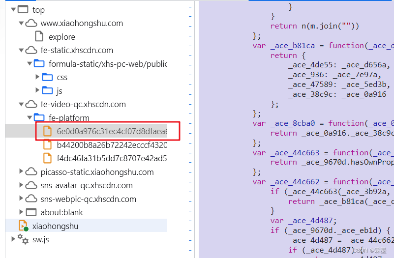

小红书加密参数X-s详解
# 小红书加密参数X-s详解

## 省略调试过程

## 定位到相关文件

如图所示：


## 修改代码
将代码复制下来，找到以下代码：

```javascript
 , function(p0, p1, p2, p3, p4, p5, p6) {
                var _ace_25a6 = _ace_ae44(p0, p1)
                  , _ace_d2389 = _ace_34d1(p2, p3);
                _ace_1ae3c(_ace_25a6._ace_936[_ace_25a6._ace_47589] = _ace_d2389, _ace_be07c, _ace_be07c, 0);
                return ++p4;
            }
```

替换为这个：

```javascript
 , function(p0, p1, p2, p3, p4, p5, p6) {
    var _ace_25a6 = _ace_ae44(p0, p1)
      , _ace_d2389 = _ace_34d1(p2, p3);
    if(typeof _ace_d2389 === 'string' && _ace_d2389.length === 29 && _ace_d2389.indexOf('|')===1){
        console.log(_ace_d2389);
        _ace_d2389 = '0|0|0|1|0|0|1|0|0|0|1|0|0|0|0';//x2=0|0|0|1|0|0|1|0|0|0|1|0|0|0|0
    }

    _ace_1ae3c(_ace_25a6._ace_936[_ace_25a6._ace_47589] = _ace_d2389, _ace_be07c, _ace_be07c, 0);
    return ++p4;
}
```

## 补全环境

使用`node`安装`JSDOM`

```bash
npm install jsdom
```

补全以下环境

```js
const {JSDOM} = require('jsdom')


var dom = new JSDOM('', {
    url: 'https://www.xiaohongshu.com/',
})

window = dom.window
var document = window.document;
```

以下是完整代码（`sign.js`）

```javascript
const {JSDOM} = require('jsdom')


var dom = new JSDOM('', {
    url: 'https://www.xiaohongshu.com/',
})

window = dom.window
var document = window.document;

require('./raw_sign') //这是网站代码修改后的代码


function sign(path, data, cookie) {
    document.cookie = cookie;
    var webmsxyw = window._webmsxyw
    return webmsxyw(path, data);
}

// let xsXt = window._webmsxyw("/api/sns/web/v1/homefeed", {
//         'cursor_score': '',
//         'num': 10,
//         'refresh_type': 3,
//         'note_index': 0,
//         'unread_begin_note_id': '',
//         'unread_end_note_id': '',
//         'unread_note_count': 0,
//         'category': 'homefeed_recommend',
//     })
//
// xsXt = window._webmsxyw('/api/sns/web/v1/user_posted?num=30&cursor=&user_id=5e55b04a000000000100b3a8', '')
xsXt = sign('/api/sns/web/v1/user_posted?num=30&cursor=&user_id=5e55b04a000000000100b3a8', '', 'a1=1887155732eqo7o91s5ai4r34iydm5goay11jpe8z50000225969;' )
console.log(xsXt)

console.log(xsXt['X-s'].length)

module.exports = sign;

```

## 启动node服务（可选）

安装express，使用以下命令：

```bash
npm install expresss
```

这是完整的服务器文件（`server.js`）

```js
const express = require('express')
const app = express()
const sign = require('./sign')
// const cookieParser = require('cookie-parser');

const port = 3000


app.use(express.json()) // for parsing application/json
app.use(express.urlencoded({ extended: true })) // for parsing application/x-www-form-urlencoded
// app.use(cookieParser())

app.post('/xiaohongshu/sign', (req, res) => {
  if(!req.body || !req.body.path){
    res.end('too little argument error')
  }
  console.log(req.body)
  // console.log(req.headers)
  const xsXt = sign(req.body.path, req.body.data, req.body.cookie);
  console.log(xsXt)
  xsXt['X-t'] = xsXt['X-t'].toString()
  res.end(JSON.stringify(xsXt))
})


app.listen(port, () => {
  console.log(`app listening on http://localhost:${port}/sign`)
})
```

python请求加密服务案例

```py
def sign_request(url: str, params: dict| str='', data:dict | str = '', cookie: str = '') ->dict:
    # params = {
    #     'num': '30', 'cursor': '', 'user_id': '5e55b04a000000000100b3a8',
    # }
    # url = 'https://edith.xiaohongshu.com/api/sns/web/v1/user_posted'
    if not data:
        data = ''
    path = urlparse(url).path + ('?' + urlencode(params) if params else '')
    response = requests.post('http://localhost:3000/xiaohongshu/sign', json={'path': path, 'data': data, 'cookie': cookie})
    # response = requests.post('https://liaochanglin.top/xiaohongshu/sign', json={'path': path, 'data': data, 'cookie': cookie})
    if not response.ok:
        return dict()
    # print(response.json())
    return response.json()
```

## 测试

```python
# 替换成你自己的cookie
cookies = {
    'a1': '', 
    'web_session': '',
}
headers = {
    'content-type': 'application/json;charset=UTF-8',
    'origin': 'https://www.xiaohongshu.com',
    'referer': 'https://www.xiaohongshu.com/',
    'user-agent': 'Mozilla/5.0 (Windows NT 10.0; Win64; x64) AppleWebKit/537.36 (KHTML, like Gecko) Chrome/109.0.0.0 Safari/537.36',
    # 'x-s': 'ZBMpOj1LZgTbOjcL0j5C0gMWZ2FisY5WslTKsYF+1g93',
    # 'x-t': '1679315189945',
}

data = {
    'cursor_score': '1.6852626069610028E9', 'num': 20, 'refresh_type': 3, 'note_index': 0,
    'unread_begin_note_id': '', 'unread_end_note_id': '', 'unread_note_count': 0, 'category': 'homefeed_recommend',
    'search_key': '',
}
data_str = json.dumps(data, separators=(',', ':'))  # 去除空格
url = 'https://edith.xiaohongshu.com/api/sns/web/v1/homefeed'

x = sign_request(url, data=data)

print(x)
headers.update(x)
response = requests.post(url, cookies=cookies, headers=headers, data=data_str)
print(response.status_code)
if not response.ok:
    raise Exception('Could not found response data: %s')
result = response.json()
if not result['success']:
    print(result)
    return
print(result);
return result['data']
```